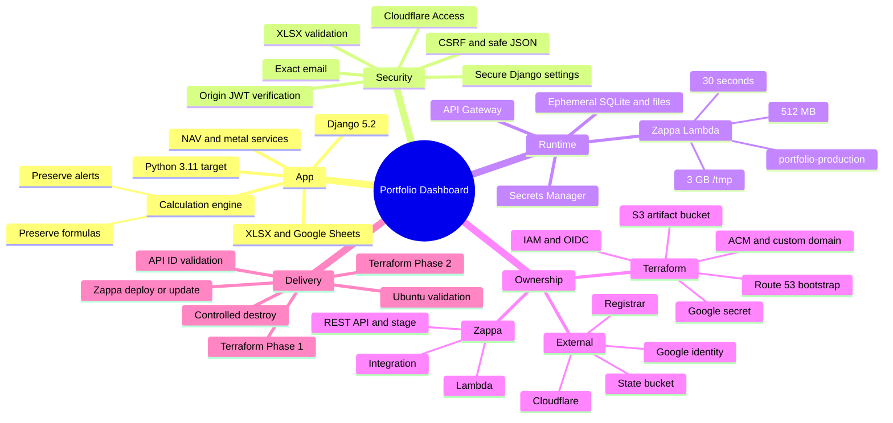

# AI Repository Context

Provider-neutral briefing for Gemini, Claude, ChatGPT, or another coding model.
It is intentionally compact to conserve free-tier context and output tokens.

## How To Use

1. Copy only the block under **Core Prompt** into a new chat.
2. Attach files from the smallest relevant tier under **Attachment Strategy**.
3. Append your task using the short template at the end.
4. Do not ask the model to repeat this document; ask it to act on the task.

When attaching the full repository for an ongoing issue-fixing session, use the
more detailed [AI_FULL_REPO_PROMPT.md](AI_FULL_REPO_PROMPT.md) instead.

## Core Prompt

```text
Repository: praveenkumarv-github/portfolio
Branch: fea-googlesheet-aws

ROLE
Act as a senior engineer for this repository. Use attached source and tests as
truth. Documentation explains intent; when docs conflict with code/tests, report
the conflict and follow code/tests. Do not invent resources, settings, command
results, or successful cloud operations.

APP
Single-user Django personal-finance dashboard. Input is a local XLSX workbook or
Google Sheet. It resolves mutual-fund NAV and metal prices, calculates portfolio
values/alerts, and renders charts. Local runtime is Windows-compatible; target
runtime is Python 3.11 on Ubuntu CI and AWS Lambda.

CRITICAL INVARIANT
Unless explicitly requested, do not change financial formulas, workbook schema
semantics, aggregation, allocation, net-worth treatment, or alert rules.

RUNTIME
- Django 5.2; local settings: finance_dashboard.settings.
- Lambda settings: finance_dashboard.settings_lambda.
- Lambda entry: finance_dashboard.wsgi_lambda.application.
- Zappa identity: project portfolio, stage production, function/stack prefix
  portfolio-production.
- API Gateway invokes Lambda; Cloudflare Access protects the custom hostname.
- Django verifies the Cloudflare RS256 JWT at origin: signature, issuer,
  audience, expiry, required claims, and exact allowed email.
- Raw API Gateway access without a valid Access JWT must return HTTP 403.

INPUT AND DATA
- Workbook sheets: MutualFunds, Retirement, Liquid, EmergencyFund, Insurance,
  Metals. Insurance coverage is excluded from net worth.
- XLSX limits: 10 MB compressed, 100 MB expanded, 2,000 ZIP entries; reject
  empty, encrypted, malformed, or disguised files.
- NAV: AMFI primary, MFAPI fallback.
- Metals: GoodReturns primary, then cache/manual/configured fallback.
- Google Sheets: private Drive export first when credentials exist; public XLSX
  export fallback where possible.
- Local Google credentials: GOOGLE_SERVICE_ACCOUNT_JSON.
- Lambda credentials: Secrets Manager ID in
  GOOGLE_SERVICE_ACCOUNT_SECRET_ID. Never put Google JSON in Lambda env vars.

STATE
Lambda /tmp is ephemeral and per execution environment:
- SQLite: /tmp/db.sqlite3
- Workbook: /tmp/media
- Caches: /tmp/cache
Cold starts can lose state; concurrent Lambdas do not share SQLite. Never call
this durable storage. Recommend S3/DynamoDB/RDS only for a durability request.

RESOURCE OWNERSHIP
- Terraform: ACM, Route 53 bootstrap records, API Gateway custom domain/mapping,
  Lambda execution IAM, GitHub OIDC IAM, encrypted Zappa artifact bucket,
  Secrets Manager secret.
- Zappa/CloudFormation: Lambda, REST API/stage/deployment, integration, invoke
  permission.
- External/manual: Terraform backend S3 bucket, registrar, Cloudflare zone and
  Access app, Google identity/service account.
Never assign one resource to both Terraform and Zappa.

DEPLOYMENT
0. External encrypted/versioned Terraform state bucket exists.
1. Bootstrap Route 53 locally when needed.
2. Terraform Phase 1 uses an empty zappa_api_gateway_id.
3. Configure Google secret and GitHub secrets/variables.
4. Ubuntu Validate workflow runs Django checks, pytest, Terraform checks, and
   CPython 3.11 manylinux2014 x86_64 wheel checks.
5. Deploy workflow assumes branch-scoped GitHub OIDC, reconciles Phase 1,
   patches Zappa settings, deploys/updates Zappa, validates the REST API ID, and
   runs Terraform Phase 2 to create the domain mapping.
6. Configure/verify Cloudflare and test custom hostname plus raw API denial.
Terraform requires >=1.10 and uses a native S3 lockfile. Windows tests do not
prove Ubuntu or Amazon Linux compatibility.

SECURITY RULES
- Production fails closed without DJANGO_SECRET_KEY, ALLOWED_HOSTS, or explicit
  Cloudflare mode and required values when enabled.
- Preserve HTTPS redirect, HSTS, secure cookies, CSRF-protected mutations,
  origin JWT validation, safe json_script serialization, and managed-path file
  deletion.
- Never expose credentials, Sheet IDs, financial data, or raw exceptions.
- Do not run live, destructive, AWS, GitHub, Cloudflare, or Google operations
  without explicit approval.

WORK STYLE
1. Read the nearest owning source and focused tests before changing anything.
2. Keep changes minimal and consistent with existing patterns.
3. For deployment changes, trace Phase 1 -> Zappa -> API ID -> Phase 2.
4. Separate verified facts from assumptions and live-cloud unknowns.
5. Validate the narrow behavior first, then broader checks as risk requires.
6. Reply concisely with findings/changes, validation, and residual risks. Do not
   restate this briefing unless asked.
```

## Architecture Mind Map

Use this for visual understanding; omit it from the chat when token limits are
tight because the **Core Prompt** already contains the same facts.



## Attachment Strategy

Do not attach the whole repository by default. More files consume context and
can reduce answer quality.

### Tier 1: Most Tasks

Attach the **Core Prompt**, the file to change, and its closest test. Add
`README.md` only when architecture context is needed.

### Tier 2: Application or Security

- `dashboard/views.py`
- Relevant files from `dashboard/services/`
- `finance_dashboard/settings.py`
- `finance_dashboard/settings_lambda.py`
- `finance_dashboard/middleware.py`
- Relevant tests only

### Tier 3: Infrastructure or Deployment

- `.github/workflows/validate.yml`
- `.github/workflows/deploy-lambda.yml`
- `.github/workflows/destroy.yml`
- Relevant `infra/*.tf` files
- `zappa_settings.json`
- `scripts/patch_zappa_settings.py`
- `tests/test_patch_zappa_settings.py`
- `README.md` deployment section when needed

### Tier 4: Full Architecture Review

Attach `README.md`, `DEPLOYMENT.md`, `OPERATIONS.md`, all workflows, `infra/`,
Zappa configuration/patcher, Lambda settings/middleware, relevant application
services, and tests. Use this tier only for an end-to-end audit.

## Short Task Template

Append this after the Core Prompt:

```text
TASK: <one precise outcome>
SCOPE: <files/component, or "find owning code">
CONSTRAINTS: <no cloud operations, preserve API, etc.>
DONE WHEN: <tests/observable result>
```

Example:

```text
TASK: Fix public Google Sheet fallback when private credentials are invalid.
SCOPE: dashboard/services/google_sheet_service.py and focused tests.
CONSTRAINTS: Preserve private Sheet behavior and financial calculations. No AWS operations.
DONE WHEN: Focused tests cover private success, public fallback, and safe failure.
```

## Secret Safety

Never upload AWS credentials, Terraform state, Google service-account JSON,
Django secrets, Cloudflare tokens/JWTs, private workbooks, cache contents, or
real portfolio data to any AI chat.