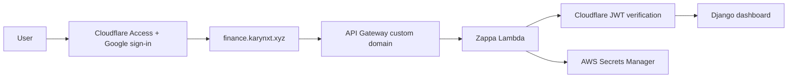

# Deployment Guide

## Architecture



Cloudflare Access authorizes one Google identity before forwarding a request. Django then verifies the `Cf-Access-Jwt-Assertion` signature, issuer, audience, expiry, and exact email. This second check denies raw `execute-api` requests that do not contain a valid application token.

## Prerequisites

- AWS account and an authenticated local AWS identity for initial Terraform bootstrap.
- Terraform 1.10 or later (required for native S3 state locking).
- Python 3.11.
- Domain registered and available for Cloudflare nameserver delegation.
- GitHub repository Actions enabled.
- Google Cloud service account only if private Sheets are required.

The Terraform backend bucket is not created by this project. Create `finance-dash-tfstate-875636131680` before `terraform init`. Enable bucket versioning, default encryption, block public access, and restrict access to the deployment role. Terraform 1.10 or later uses native S3 lockfiles through `use_lockfile = true`; no DynamoDB lock table is required.

## 1. Bootstrap Terraform and OIDC

An initial trusted AWS identity is required because GitHub cannot assume a role before that role exists.

```bash
cd infra
terraform init
terraform apply \
  -var="domain_name=karynxt.xyz" \
  -var="github_owner=praveenkumarv-github" \
  -var="github_repo=portfolio" \
  -var="github_branch=fea-googlesheet-aws"
```

Save `github_actions_role_arn` as the GitHub Actions secret `AWS_GITHUB_ACTIONS_ROLE_ARN`. OIDC trust is restricted to the configured repository and branch. No long-lived AWS key is needed in GitHub.

## 2. Store Google credentials

For private Sheets, enable Google Drive API, create a service account, and share each Sheet with its `client_email` as Viewer.

```bash
aws secretsmanager put-secret-value \
  --region ap-south-1 \
  --secret-id finance-dash/google-service-account \
  --secret-string file://key.json
```

Lambda retrieves this value at runtime using its Secrets Manager IAM policy. The JSON is not injected into Lambda environment variables. Public Sheets do not require a service account.

## 3. Configure GitHub

Repository secrets:

- `AWS_GITHUB_ACTIONS_ROLE_ARN`
- `DJANGO_SECRET_KEY`: generate at least 32 random bytes.
- `CLOUDFLARE_ACCESS_AUDIENCE`: Access application AUD tag.
- `CLOUDFLARE_ACCESS_ALLOWED_EMAIL`: the single permitted Google email.
- `GOOGLE_SERVICE_ACCOUNT_JSON`: optional; only needed if CI should upsert the AWS secret instead of using AWS CLI.

Repository variables:

- `DOMAIN_NAME=karynxt.xyz`
- `SUBDOMAIN=finance`
- `PROJECT_NAME=finance-dash`
- `ENVIRONMENT=prod`
- `ALLOWED_HOSTS=finance.karynxt.xyz,.amazonaws.com`
- `GOOGLE_SERVICE_ACCOUNT_SECRET_ID=finance-dash/google-service-account`
- `CLOUDFLARE_ACCESS_ENABLED=true`
- `CLOUDFLARE_ACCESS_TEAM_DOMAIN=https://<team-name>.cloudflareaccess.com`

Store sensitive identity values as secrets even though the AUD and email are not credentials by themselves.

## 4. Configure Cloudflare Access

Cloudflare Access requires the hostname to be proxied through a Cloudflare-managed zone.

1. Add `karynxt.xyz` to Cloudflare and replace the registrar nameservers with Cloudflare's assigned nameservers.
2. Before switching nameservers, copy the ACM validation CNAME shown by AWS into Cloudflare DNS with proxying disabled. This is required for ACM renewal.
3. Obtain the API Gateway custom domain target:

```bash
aws apigateway get-domain-name \
  --region ap-south-1 \
  --domain-name finance.karynxt.xyz \
  --query regionalDomainName \
  --output text
```

4. In Cloudflare DNS, create a proxied CNAME named `finance` pointing to that regional domain name.
5. In Zero Trust, add Google as an identity provider. For one user, One-time PIN is also feasible, but Google sign-in provides the preferred account security and MFA controls.
6. Create a self-hosted Access application for `finance.karynxt.xyz`.
7. Create one Allow policy containing only the exact approved email. Do not allow an entire email domain.
8. Copy the Application Audience (AUD) tag to the GitHub secret above.
9. Use a short session duration appropriate for personal use and enable HttpOnly and the binding cookie where browser compatibility permits.

The existing Route 53 hosted zone becomes non-authoritative after nameserver migration. Keep its Terraform resources until the Cloudflare records and ACM renewal validation are confirmed; removing it is a separate migration, not part of application deployment.

## 5. Deploy

Run the `Deploy Lambda App` workflow manually from `fea-googlesheet-aws`.

The workflow performs:

1. Terraform base reconciliation.
2. Native manylinux dependency packaging.
3. Zappa deploy/update.
4. API Gateway ID discovery.
5. Terraform custom-domain mapping.

Production startup fails closed when `DJANGO_SECRET_KEY` is missing. When Cloudflare Access is enabled, startup also requires team domain, AUD, and allowed email.

## 6. Verify

```bash
curl -i https://finance.karynxt.xyz/
curl -i https://<api-id>.execute-api.ap-south-1.amazonaws.com/production/
```

Expected behavior:

- Custom URL redirects unauthenticated browsers to Cloudflare login.
- Only the configured Google account succeeds.
- Raw API Gateway URL returns `403 Access denied` without a valid Access JWT.
- Authenticated Excel upload and public/private Google Sheet import work.
- `http://127.0.0.1:8000` remains available locally without Cloudflare.

A person possessing a still-valid Access application JWT could call the API Gateway URL until token expiry. Signature, audience, issuer, expiry, and exact-email validation substantially constrain this residual risk. Keep Access sessions short and protect the Google account with MFA.

## Updates, rollback, and destroy

Use the deployment workflow for updates. Zappa CLI operational commands are:

```bash
zappa status production
zappa tail production
zappa rollback production -n 1
```

The `Destroy Lambda App` workflow requires the literal confirmation `DESTROY`. It first removes the domain mapping, then undeploys Zappa. Terraform foundational resources are not fully destroyed by that workflow, and the secret is scheduled for seven-day recovery.
