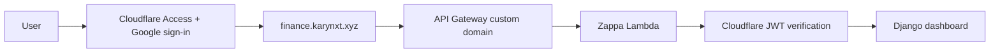

# Deployment Guide

## Architecture



Cloudflare Access authorizes one Google identity before forwarding a request. Django then verifies the `Cf-Access-Jwt-Assertion` signature, issuer, audience, expiry, and exact email. This second check denies raw `execute-api` requests that do not contain a valid application token.

## Prerequisites

- AWS account and an authenticated local AWS identity for initial Terraform bootstrap.
- Terraform 1.10 or later (required for native S3 state locking).
- Python 3.11.
- Domain registered with its Cloudflare nameservers configured at the registrar.
- GitHub repository Actions enabled.
- Cloudflare API token scoped to `Zone:DNS:Edit` for the dashboard zone.
- Google Cloud service account only if private Sheets are required.

The Terraform backend bucket is not created by this project. Create `finance-dash-tfstate-875636131680` before `terraform init`. Enable bucket versioning, default encryption, block public access, and restrict access to the deployment role. Terraform 1.10 or later uses native S3 lockfiles through `use_lockfile = true`; no DynamoDB lock table is required.

## 1. Phase 0: Bootstrap Terraform and OIDC

An initial trusted AWS identity is required because a GitHub workflow cannot create the IAM role it must already assume. Create the backend bucket, then bootstrap the OIDC provider and deployment role once from an authenticated local environment:

```bash
cd infra
terraform init
terraform apply \
  -target=aws_iam_openid_connect_provider.github \
  -target=aws_iam_role.github_actions_deploy \
  -target=aws_iam_policy.github_actions_deploy \
  -target=aws_iam_role_policy_attachment.github_actions_deploy \
  -var="domain_name=karynxt.xyz" \
  -var="github_owner=praveenkumarv-github" \
  -var="github_repo=portfolio" \
  -var="github_branch=fea-v2"
```

Save `github_actions_role_arn` as the GitHub Actions secret `AWS_GITHUB_ACTIONS_ROLE_ARN`. OIDC trust is restricted to the configured repository and branch. No long-lived AWS key is needed in GitHub.

## 2. Optional local Google credentials

For private Sheets in local development, enable Google Drive API, create a service account, and share each Sheet with its `client_email` as Viewer. Set `GOOGLE_SERVICE_ACCOUNT_JSON` locally when needed. Public Sheets do not require a service account.

## 3. Configure GitHub

Repository secrets:

- `AWS_GITHUB_ACTIONS_ROLE_ARN`
- `DJANGO_SECRET_KEY`: generate at least 32 random bytes.
- `CLOUDFLARE_ACCESS_AUDIENCE`: Access application AUD tag.
- `CLOUDFLARE_ACCESS_ALLOWED_EMAIL`: the single permitted Google email.
- `CLOUDFLARE_API_TOKEN`: token scoped to DNS edit for this zone.

Repository variables:

- `DOMAIN_NAME=karynxt.xyz`
- `SUBDOMAIN=finance`
- `PROJECT_NAME=finance-dash`
- `ENVIRONMENT=prod`
- `ALLOWED_HOSTS=finance.karynxt.xyz,.amazonaws.com`
- `CLOUDFLARE_ACCESS_ENABLED=true`
- `CLOUDFLARE_ACCESS_TEAM_DOMAIN=https://<team-name>.cloudflareaccess.com`
- `CLOUDFLARE_ZONE_ID=<Cloudflare zone ID>`
- `DEPLOY_BRANCH=fea-v2`

Store sensitive identity values as secrets even though the AUD and email are not credentials by themselves.

## 4. Configure Cloudflare Access

Cloudflare Access requires the hostname to be proxied through a Cloudflare-managed zone.

1. Add `karynxt.xyz` to Cloudflare and replace the registrar nameservers with Cloudflare's assigned nameservers.
2. In Zero Trust, add Google as an identity provider. For one user, One-time PIN is also feasible, but Google sign-in provides the preferred account security and MFA controls.
3. Create a self-hosted Access application for `finance.karynxt.xyz`.
4. Create one Allow policy containing only the exact approved email. Do not allow an entire email domain.
5. Copy the Application Audience (AUD) tag to the GitHub secret above.
6. Use a short session duration appropriate for personal use and enable HttpOnly and the binding cookie where browser compatibility permits.

The Phase 2 workflow creates or updates the unproxied ACM validation CNAME and the proxied `finance` CNAME. Keep the validation record permanently for certificate renewal.

## 5. Deploy with two workflows

Run `Phase 1 - Deploy Infrastructure and Lambda` from `fea-v2`. It:

1. Reconciles the baseline Terraform state in `infra/`.
2. Packages native manylinux dependencies.
3. Deploys or updates `portfolio-production` with Zappa.
4. Validates that Zappa produced a REST API ID.

After Phase 1 succeeds, run `Phase 2 - Deploy Cloudflare and Domain`. It:

1. Publishes ACM validation CNAMEs to Cloudflare without proxying.
2. Discovers the Zappa REST API from the `portfolio-production` CloudFormation stack.
3. Applies the independent `infra/domain/` Terraform state to validate ACM and create the API Gateway custom domain and mapping.
4. Creates or updates the proxied `finance` CNAME in Cloudflare.

Both workflows are idempotent and share one concurrency group, so they cannot mutate production simultaneously. Run Phase 2 again after certificate or domain configuration changes; normal application-only updates require Phase 1 only.

Production startup fails closed when `DJANGO_SECRET_KEY` is missing. When Cloudflare Access is enabled, startup also requires team domain, AUD, and allowed email.

## 6. Verify

```bash
curl -i https://finance.karynxt.xyz/
curl -i https://<api-id>.execute-api.ap-south-1.amazonaws.com/production/
```

Expected behavior:

- Custom URL redirects unauthenticated browsers to Cloudflare login.
- Only the configured Google account succeeds.
- Raw API Gateway URL returns `403 Access denied` without a valid Access JWT.
- Authenticated Excel upload and public/private Google Sheet import work.
- `http://127.0.0.1:8000` remains available locally without Cloudflare.

A person possessing a still-valid Access application JWT could call the API Gateway URL until token expiry. Signature, audience, issuer, expiry, and exact-email validation substantially constrain this residual risk. Keep Access sessions short and protect the Google account with MFA.

## Updates, rollback, and destroy

Use the deployment workflow for updates. Zappa CLI operational commands are:

```bash
zappa status production
zappa tail production
zappa rollback production -n 1
```

The `Destroy Lambda App` workflow requires the literal confirmation `DESTROY`. It first removes the domain mapping, then undeploys Zappa. Terraform foundational resources are not fully destroyed by that workflow, and the secret is scheduled for seven-day recovery.
