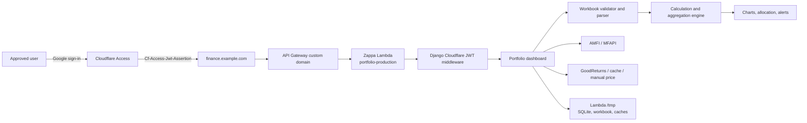
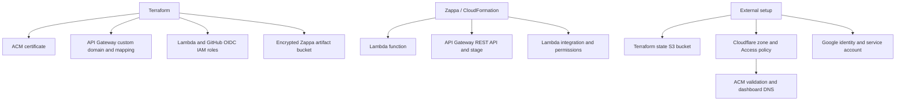
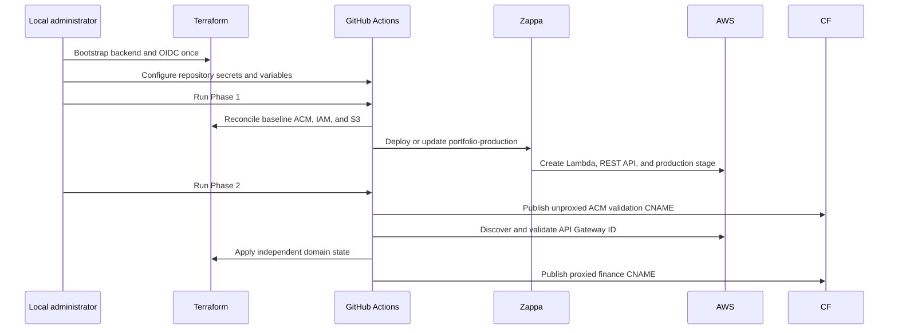

# Personal Finance Dashboard

A single-user Django dashboard for tracking mutual funds, retirement accounts,
liquid assets, emergency funds, insurance, gold, and silver from an Excel
workbook or Google Sheet.

Production runs on AWS Lambda and API Gateway through Zappa. Terraform owns the
supporting AWS infrastructure, GitHub Actions deploys through branch-scoped
OIDC, and Cloudflare Access protects the public hostname. Django verifies the
Cloudflare identity token again at the origin, so the raw API Gateway URL is not
an authentication bypass.

## Contents

- [Architecture](#architecture)
- [What Was Implemented](#what-was-implemented)
- [Data Flow and Storage](#data-flow-and-storage)
- [Local Development](#local-development)
- [Production Deployment](#production-deployment)
- [Verification](#verification)
- [Updates and Rollback](#updates-and-rollback)
- [Destroy Process](#destroy-process)
- [Troubleshooting](#troubleshooting)
- [Security and Operational Limits](#security-and-operational-limits)

## Architecture

### Runtime architecture



### Resource ownership



### Deployment sequence



## What Was Implemented

### Google Sheets and credentials

- Private Google Drive export using a service account.
- Public Google Sheet XLSX export when credentials are absent or private access
  is unavailable.
- Local private-Sheet support through `GOOGLE_SERVICE_ACCOUNT_JSON`.
- Safe error messages and logs that omit Sheet IDs and credentials.
- Unique imported filenames to prevent a repeated Google import from deleting
  its newly downloaded workbook.

### Workbook and application security

- Maximum compressed workbook size: 10 MB.
- Maximum expanded ZIP size: 100 MB.
- Maximum ZIP entries: 2,000.
- Rejection of encrypted, malformed, empty, and non-XLSX ZIP files.
- Required XLSX metadata checks before pandas/openpyxl parsing.
- Managed-file deletion restricted to files below `MEDIA_ROOT`.
- Transactional replacement of the active workbook with cleanup on failure.
- Chart data emitted with Django `json_script` instead of unsafe inline
  JavaScript, preventing workbook-controlled stored XSS.
- Metal-price refresh changed from state-changing GET to CSRF-protected POST.
- Generic user-facing failures while detailed diagnostics remain in logs.

### Production authentication

- Cloudflare Access with an exact approved Google email.
- Origin-side RS256 JWT verification in Django.
- Verification of issuer, audience, expiry, required claims, and exact email.
- Cached Cloudflare JWK client for warm Lambda invocations.
- Fail-closed Lambda startup when required authentication settings are missing.
- Raw `execute-api` requests without a valid Access assertion return HTTP 403.

### Production hardening

- Required `DJANGO_SECRET_KEY` and explicit `ALLOWED_HOSTS`.
- HTTPS redirect and one-year HSTS.
- Secure, HttpOnly, SameSite=Lax session and CSRF cookies.
- Same-origin referrer policy and frame denial.
- Signed-cookie sessions and cookie messages to avoid ephemeral SQLite session
  failures.
- Upload and cache paths moved to Lambda's writable `/tmp` filesystem.

### Deployment and release engineering

- Terraform Phase 1 -> Zappa -> Terraform Phase 2 deployment workflow.
- Branch-scoped GitHub OIDC trust with no long-lived AWS access key in GitHub.
- Native S3 Terraform state locking with Terraform 1.10 or later.
- Serialized production deployments through GitHub Actions concurrency.
- Tested Zappa settings patcher with required configuration checks.
- Pinned Zappa project identity: `portfolio-production`.
- CPython 3.11 manylinux2014 x86_64 wheel validation for NumPy, pandas, and
  pysqlite3.
- API Gateway ID format validation before Terraform receives it.
- Ubuntu validation workflow for Django, tests, Terraform, and Lambda wheels.
- Django 5.2.16 and PyJWT 2.13.0 security upgrades.

Portfolio formulas, workbook schema meanings, allocation logic, net-worth
calculations, and alert rules were not changed by these enhancements.

## Data Flow and Storage

1. The user uploads an XLSX file or supplies a Google Sheet URL.
2. The workbook validator rejects unsafe or malformed files.
3. The parser reads the supported sheets and columns.
4. AMFI resolves mutual-fund NAV, with MFAPI as fallback.
5. GoodReturns resolves metal prices, with cache, manual value, and configured
   defaults as fallback.
6. The calculation engine produces allocation, net worth, risk coverage, and
   alerts.
7. Django renders the dashboard and records the active file and snapshot.

### Excel schema

| Sheet | Required columns |
|---|---|
| `MutualFunds` | `FundName`, `Units`, `Identifier` |
| `Retirement` | `Type`, `Amount` |
| `Liquid` | `AccountName`, `Type`, `Amount` |
| `EmergencyFund` | `AccountName`, `Type`, `Amount`, `MaturityDate` |
| `Insurance` | `Type`, `Provider`, `Premium`, `Coverage` |
| `Metals` | `Type`, `Quantity` |

`Identifier` is an AMFI scheme code or ISIN. `MaturityDate` uses `YYYY-MM-DD`.
Insurance is risk coverage and is intentionally excluded from net worth.

### Storage durability

| Data | Local development | Lambda production |
|---|---|---|
| SQLite | `db.sqlite3` | `/tmp/db.sqlite3` |
| Active workbook | `media/` | `/tmp/media/` |
| NAV cache | `cache/` | `/tmp/cache/` |
| Metal cache | `data/` | `/tmp/cache/` |

Lambda `/tmp` is ephemeral and private to one execution environment. A cold
start or parallel Lambda environment can have a new database and no workbook.
Reload the source workbook when necessary. Move application state to durable
S3/DynamoDB/RDS storage before treating snapshots as permanent history.

## Local Development

Python 3.11 is the supported local and Lambda version.

### Windows 11 PowerShell

```powershell
py -3.11 -m venv .venv
.\.venv\Scripts\Activate.ps1
python -m pip install --upgrade pip
pip install -r requirements.txt
python manage.py migrate
python generate_sample_excel.py
python manage.py runserver
```

Open `http://127.0.0.1:8000`. Local settings do not require Cloudflare Access.

For a private Google Sheet:

```powershell
$env:GOOGLE_SERVICE_ACCOUNT_JSON = Get-Content .\key.json -Raw
python manage.py runserver
```

Share the Sheet with the service account's `client_email` as Viewer. For a
public Sheet, leave `GOOGLE_SERVICE_ACCOUNT_JSON` unset.

### Local checks

```powershell
.\.venv\Scripts\python.exe manage.py check
.\.venv\Scripts\python.exe manage.py makemigrations --check --dry-run
.\.venv\Scripts\python.exe -m pytest -q
terraform -chdir=infra fmt -check -recursive
terraform -chdir=infra init -backend=false -input=false
terraform -chdir=infra validate
```

Do not commit `.env`, `key.json`, financial workbooks, generated databases, or
runtime cache values.

## Production Deployment

The production process has one local IAM/backend bootstrap and two independent,
rerunnable GitHub workflows.

### Prerequisites

- An AWS account and a local authenticated AWS session with permission to
  bootstrap Terraform and IAM.
- Terraform 1.10 or later.
- Git and Python 3.11.
- A registered domain.
- GitHub Actions enabled for `praveenkumarv-github/portfolio`.
- A Cloudflare account and Google identity.
- A Google Cloud service account only when private Sheets are required.

All examples use:

| Setting | Example |
|---|---|
| AWS region | `ap-south-1` |
| Root domain | `karynxt.xyz` |
| Dashboard host | `finance.karynxt.xyz` |
| Terraform project | `finance-dash` |
| Environment | `prod` |
| Zappa project/stage | `portfolio` / `production` |
| Allowed GitHub branch | `fea-v2` |

Replace domain and account-specific values where required. Keep the Zappa
project name `portfolio` unless intentionally migrating the existing Lambda and
CloudFormation stack.

### Step 0 - Create the Terraform backend

The backend bucket is deliberately outside this Terraform stack because
Terraform must access its backend before it can create resources. Create the S3
bucket named in `infra/backend.tf` once:

```text
finance-dash-tfstate-875636131680
```

Configure it with:

- Region `ap-south-1`.
- Block all public access.
- Default server-side encryption.
- Bucket versioning.
- Access restricted to administrators and the GitHub deployment role.

Terraform uses `prod/terraform.tfstate` and native S3 lockfiles. Do not create a
DynamoDB lock table. If using another AWS account, change the backend bucket in
`infra/backend.tf` and the matching state-bucket ARNs in
`infra/github_actions.tf` before initialization.

### Step 1 - Bootstrap GitHub OIDC locally

GitHub cannot create the IAM role it must already assume. After creating the
backend bucket, bootstrap the OIDC provider and deployment role once with an
authenticated local AWS identity:

```bash
terraform -chdir=infra init
terraform -chdir=infra apply \
  -target=aws_iam_openid_connect_provider.github \
  -target=aws_iam_role.github_actions_deploy \
  -target=aws_iam_policy.github_actions_deploy \
  -target=aws_iam_role_policy_attachment.github_actions_deploy \
  -var="domain_name=karynxt.xyz" \
  -var="github_owner=praveenkumarv-github" \
  -var="github_repo=portfolio" \
  -var="github_branch=fea-v2"

terraform -chdir=infra output github_actions_role_arn
```

Save that output as `AWS_GITHUB_ACTIONS_ROLE_ARN`. This targeted apply is the
only local infrastructure phase. Phase 1 completes the baseline state; Phase 2
uses a separate `prod/domain.tfstate`, so later Phase 1 runs cannot remove the
custom domain.

### Step 2 - Configure Google access when needed

For private Sheets, enable Google Drive API, create a service account, and share
the Sheet with its `client_email` as Viewer.

For local private-sheet testing, set `GOOGLE_SERVICE_ACCOUNT_JSON` in your local
environment. Public Sheets can use the public-export fallback without service-account
credentials.

### Step 3 - Configure GitHub Actions

Add these repository secrets under **Settings -> Secrets and variables ->
Actions -> Secrets**:

| Secret | Value |
|---|---|
| `AWS_GITHUB_ACTIONS_ROLE_ARN` | `terraform output github_actions_role_arn` |
| `DJANGO_SECRET_KEY` | Long random production-only Django secret |
| `CLOUDFLARE_ACCESS_AUDIENCE` | Cloudflare Access application AUD tag |
| `CLOUDFLARE_ACCESS_ALLOWED_EMAIL` | Exact permitted Google email |
| `CLOUDFLARE_API_TOKEN` | Zone-scoped token with `Zone:DNS:Edit` |

Add these repository variables under **Actions -> Variables**:

| Variable | Example |
|---|---|
| `DOMAIN_NAME` | `karynxt.xyz` |
| `SUBDOMAIN` | `finance` |
| `PROJECT_NAME` | `finance-dash` |
| `ENVIRONMENT` | `prod` |
| `ALLOWED_HOSTS` | `finance.karynxt.xyz,.amazonaws.com` |
| `CLOUDFLARE_ACCESS_ENABLED` | `true` |
| `CLOUDFLARE_ACCESS_TEAM_DOMAIN` | `https://<team>.cloudflareaccess.com` |
| `CLOUDFLARE_ZONE_ID` | Cloudflare zone ID for `karynxt.xyz` |
| `DEPLOY_BRANCH` | `fea-v2` |
| `LAMBDA_LAYER_ARNS` | Optional comma-separated layer ARNs; normally empty |

The OIDC trust policy only accepts tokens from the configured repository and
branch. GitHub does not need long-lived AWS access-key secrets.

### Step 4 - Run Phase 1

Before deployment, confirm the `Validate` workflow passes on the branch.

From GitHub:

1. Open **Actions**.
2. Select **Phase 1 - Deploy Infrastructure and Lambda**.
3. Select **Run workflow**.
4. Choose branch `fea-v2`.
5. Set `zappa_stage` to `production`.
6. Run the workflow.

The equivalent GitHub CLI command is:

```bash
gh workflow run "Phase 1 - Deploy Infrastructure and Lambda" \
  --ref fea-v2 \
  -f zappa_stage=production
```

The workflow performs these operations in order:

1. Assumes the AWS deployment role with GitHub OIDC.
2. Installs Python 3.11 dependencies and Amazon Linux-compatible native wheels.
3. Reconciles the baseline Terraform state.
4. Reads Terraform's Lambda role and artifact-bucket outputs.
5. Patches Zappa settings and validates all required production values.
6. Optionally upserts the Google credential secret.
7. Deploys a new Zappa stack or updates the existing one.
8. Reads and validates the REST API ID from `zappa status`.
9. Stops without changing Cloudflare or the custom-domain state.

### Step 5 - Run Phase 2

Run **Phase 2 - Deploy Cloudflare and Domain** after Phase 1 succeeds:

```bash
gh workflow run "Phase 2 - Deploy Cloudflare and Domain" \
  --ref fea-v2 \
  -f zappa_stage=production
```

The workflow publishes the unproxied ACM validation CNAME, discovers the REST
API from `portfolio-production`, applies `infra/domain`, and publishes the
proxied `finance` CNAME. The Cloudflare zone, nameserver delegation, Google
identity provider, Access application, and exact-email policy remain manual
prerequisites. Do not delete the ACM validation CNAME after deployment.

## Verification

Verify after every production deployment:

| Check | Expected result |
|---|---|
| `https://finance.karynxt.xyz/` without a session | Cloudflare login |
| Approved Google account | Dashboard loads |
| Another identity | Access denied |
| Raw API Gateway URL without JWT | HTTP 403 |
| Local `http://127.0.0.1:8000` | Loads without Cloudflare |
| Valid local XLSX upload | Portfolio renders |
| Public Google Sheet | Imports through public export |
| Shared private Google Sheet | Imports through Drive API |
| Invalid/oversized workbook | Rejected without processing |
| Metal refresh GET | Does not mutate state |
| Metal refresh POST | Refreshes with CSRF protection |

Useful local HTTP checks:

```bash
curl -I https://finance.karynxt.xyz/
curl -i https://<api-id>.execute-api.ap-south-1.amazonaws.com/production/
```

The first request should enter Cloudflare authentication. The second should
return `403 Access denied` without a valid Cloudflare Access JWT.

## Updates and Rollback

### Normal update

Push the tested change to `fea-v2`, wait for `Validate`, then run Phase 1. Zappa
detects the existing deployment and runs an update. Phase 2 is only required
when the certificate, domain mapping, API identity, or Cloudflare DNS changes.

### Rollback

From an authenticated operational environment containing the deployment
dependencies:

```bash
python -m zappa.cli status production
python -m zappa.cli tail production --since 10m
python -m zappa.cli rollback production -n 1
```

Rollback changes Lambda code only. If Terraform infrastructure changed, revert
the infrastructure change separately and apply the reviewed Terraform plan.

## Destroy Process

The **Destroy Lambda App** workflow is intentionally not a full Terraform
destroy. It performs:

1. Terraform destroy of the independent domain state to remove the mapping and custom domain.
2. Zappa undeploy to remove the Lambda/API Gateway stack.

Run it from GitHub Actions and enter the exact confirmation `DESTROY` with stage
`production`.

The workflow retains foundational Terraform resources such as the certificate,
IAM roles, artifact bucket, and OIDC provider. Cloudflare DNS records also
remain and can be removed separately with reviewed DNS access. A
full teardown requires a separately reviewed local `terraform destroy`. Back up
state and any required workbook data before destructive operations. The
external Terraform backend bucket is never destroyed by this stack.

## Troubleshooting

### Terraform init fails

- Confirm the backend bucket exists in `ap-south-1`.
- Confirm the bucket name and state ARNs match the AWS account.
- Confirm the local identity can read/write the state object and lockfile.
- Never delete a lockfile while another Terraform operation is running.

### Terraform waits for ACM validation

- Confirm the active authoritative nameservers.
- Confirm the exact ACM CNAME exists in the authoritative DNS provider.
- Leave the validation record unproxied in Cloudflare.

### GitHub cannot assume the AWS role

- Confirm `AWS_GITHUB_ACTIONS_ROLE_ARN` matches Terraform output.
- Confirm the run uses `praveenkumarv-github/portfolio` and the allowed branch.
- Confirm workflow permission `id-token: write` remains enabled.

### Dashboard returns 403

- Confirm the Cloudflare application hostname and exact-email policy.
- Confirm team domain, AUD, and allowed email values.
- Confirm the raw API URL is expected to return 403 without a valid assertion.
- Check Lambda logs for JWK retrieval or token-validation failures.

### Dashboard returns 5xx

- Inspect the failed workflow's CloudWatch tail step or Lambda log group.
- Confirm the Django secret and allowed hosts are present.
- Confirm Python 3.11 manylinux wheels were installed.
- Confirm Lambda has 3 GB ephemeral storage.
- Reload the workbook after a cold start if `/tmp` was cleared.

### Google Sheet import fails

- Confirm Google Drive API is enabled.
- Confirm a private Sheet is shared with the service-account `client_email`.
- Test a public Sheet export to isolate Drive API authentication.
- Search logs for `[GSheet]`; identifiers and credentials are intentionally
  omitted.

## Security and Operational Limits

- This is a single-user application, not a multi-tenant platform.
- Lambda `/tmp` data and SQLite snapshots are not durable.
- The deployment role remains broad because Zappa manages Lambda,
  CloudFormation, API Gateway, IAM, S3, logs, and events. OIDC restricts who can
  assume it; further reduction should use CloudTrail-observed actions.
- CloudWatch alarms, explicit log retention, AWS Budget alerts, and WAF rules
  are not currently provisioned.
- HSTS subdomain inclusion and preload are intentionally disabled because they
  should only be enabled when every subdomain is permanently HTTPS-only.
- AMFI, MFAPI, Google, and GoodReturns availability can affect market-data
  freshness.
- Protect the approved Google identity with MFA and keep Cloudflare Access
  sessions short.

Additional operational detail is available in [DEPLOYMENT.md](DEPLOYMENT.md) and
[OPERATIONS.md](OPERATIONS.md). The README is the canonical end-to-end setup
sequence.

For a token-efficient Gemini, Claude, or ChatGPT repository briefing and mind
map, see [AI_CONTEXT.md](AI_CONTEXT.md).

For a full-repository working session with reusable issue instructions, see
[AI_FULL_REPO_PROMPT.md](AI_FULL_REPO_PROMPT.md).
